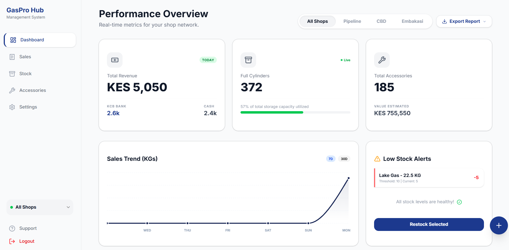

# GasPro Hub Gas Management System 🚀

A comprehensive, state-of-the-art solution for managing gas cylinder business operations across multiple branches. Built with modern web technologies, GasPro Hub provides real-time stock tracking, sales logging, and performance analytics.



## 🌟 Key Features

- **📊 Interactive Dashboard**: Real-time visualization of sales trends (KGs), total revenue, and stock capacity.
- **🏠 Multi-Shop Support**: Seamlessly switch between different branches to monitor performance and inventory.
- **📦 Cylinder Stock Management**: Daily snapshots for tracking full and empty cylinders by brand and size.
- **💰 Smart Sales Logging**: Log daily sales with support for multiple payment methods (Cash, KCB Bank) and automatic discount calculations.
- **🛠️ Accessories Inventory**: Manage peripheral items like regulators, hose pipes, grills, and burners.
- **⚠️ Low Stock Alerts**: Automatic notifications for items falling below safety thresholds.
- **📄 Export Reports**: Generate professional PDF receipts and Excel reports for sales and stock data.
- **📱 Responsive Design**: Fully optimized for mobile, tablet, and desktop use.

## 🛠️ Tech Stack

- **Framework**: [Next.js 15+](https://nextjs.org/) (App Router)
- **Styling**: [Tailwind CSS 4](https://tailwindcss.com/)
- **UI Components**: [Shadcn/UI](https://ui.shadcn.com/), [Base UI](https://base-ui.com/), [Lucide React](https://lucide.dev/)
- **Database & Auth**: [Supabase](https://supabase.com/) (PostgreSQL)
- **Charts**: [Recharts](https://recharts.org/)
- **Data Export**: [jsPDF](https://parall.ax/products/jspdf), [xlsx (SheetJS)](https://sheetjs.com/)
- **Language**: [TypeScript](https://www.typescriptlang.org/)

## 🚀 Getting Started

### Prerequisites

- Node.js 18+
- A Supabase account

### Installation

1. **Clone the repository**:

   ```bash
   git clone https://github.com/BarasaIan11/gas-management.git
   cd gas-management
   ```

2. **Install dependencies**:

   ```bash
   npm install
   ```

3. **Set up Environment Variables**:
   Create a `.env.local` file in the root directory:

   ```env
   NEXT_PUBLIC_SUPABASE_URL=your_supabase_project_url
   NEXT_PUBLIC_SUPABASE_ANON_KEY=your_supabase_anon_key
   ```

4. **Initialize Database**:
   Run the SQL scripts found in the `supabase/` directory (`schema.sql` and `seed_data.sql`) in your Supabase SQL Editor to set up the tables and initial accessory types.

5. **Run the development server**:
   ```bash
   npm run dev
   ```

Open [http://localhost:3000](http://localhost:3000) to see the app in action.

## 📖 How It Works

### Architecture

GasPro Hub uses a modern **Server-Side First** architecture:

- **Server Actions**: All data mutations (logging sales, updating stock) are handled via Next.js Server Actions for security and performance.
- **Supabase SSR**: Authentication and database connections are managed through the `@supabase/ssr` package, ensuring seamless session management.

### Workflow

1. **Setup**: Add your shops and pricing matrix in the Settings page.
2. **Opening Stock**: Each morning, log the opening stock of full and empty cylinders.
3. **Daily Sales**: As sales occur, log them using the quick-access "Plus" button.
4. **Monitoring**: Use the dashboard to check for low stock alerts and monitor daily revenue trends.
5. **Closing**: Export the daily summary to PDF or Excel for accounting.

## 📄 License

This project is licensed under the MIT License - see the LICENSE file for details.

---

Built with ❤️ for better business management.
